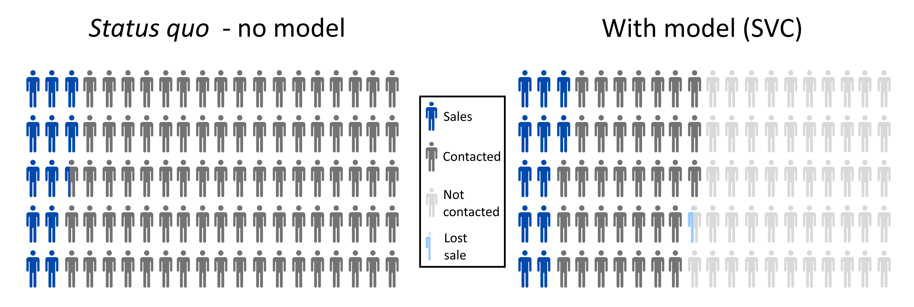

# Predicting insurance cross-sell with machine learning
This project uses machine learning to predict whether or not a current health insurance customer will buy car insurance after being contacted with an offer.  
The underlying data came [from Kaggle](https://www.kaggle.com/anmolkumar/health-insurance-cross-sell-prediction), and contains information on previous sales. the goal is to maximise profit by:
* correctly identifying as non-many buyers as possible,
* while also preserving as many sales as possible.
  The data was transformed and upsampled using SMOTENC prior to testing various classifiers, including logistic regression, support vector classifiers, KNN classifiers and random forest classifiers.  
After testing classifiers with their default hyperparameters, a grid search was performed to identify the optimal combination of hyperparameters. A voting and stacking classifier were also tested.  
Ultimately, a linear support vector classifier (SVC) was chosen. It correctly identifies 52% of customers as non-buyers who do not need to be contacted. At the same time, the model correctly selects ~98% of the buyers for targetting. If implemented, the model would save between \\$x-\\$x per 100,000 existing customers. The impact of the model is shown below:

